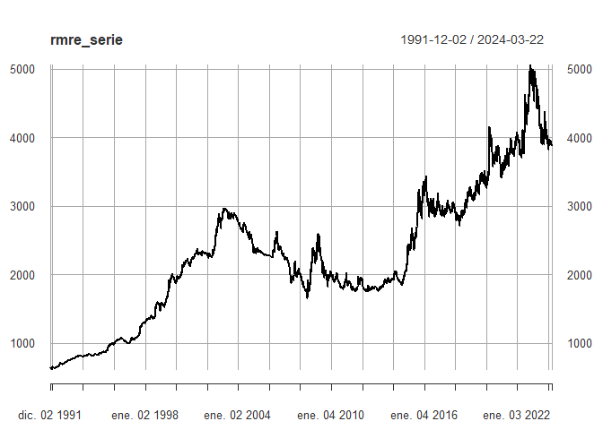

# citmre

The Colombian Index Tool (Market Rate Exchange) package downloads the 
Colombian Market Rate from the source:
<https://www.datos.gov.co/Econom-a-y-Finanzas/TRM/ceyp-9c7c/data>, for
direct use in Python.

## Installation

You can install the development version of citmre from:
[GitHub](https://github.com/SergioFinances/citmre)

```bash
pip install citmre=0.1.0
```
## Example

```bash
from citmre.citmre_fun import rmre_data

# Show full series dataset
rmre_serie = citmre.rmre_data()

# Show monthly dataset with Plotly Graph
rmre_splited = citmre.rmre_data(frequency=12, log_return=False, plot_data=True)

# Show quaterly log_return dataset with Plotly Graph
rmre_splited = citmre.rmre_data(frequency=4, log_return=True, plot_data=True, type="mean")

# Show splited log return dataset
rmre_splited = citmre.rmre_data('2000-01-01','2023-12-31', log_return=True)

#> "Warning: The information will be obtained from the next business day, as the desired date is a holiday or weekend."
```



## Referencias

Source: Portal de Datos Abiertos \<www.datos.gov.co\>